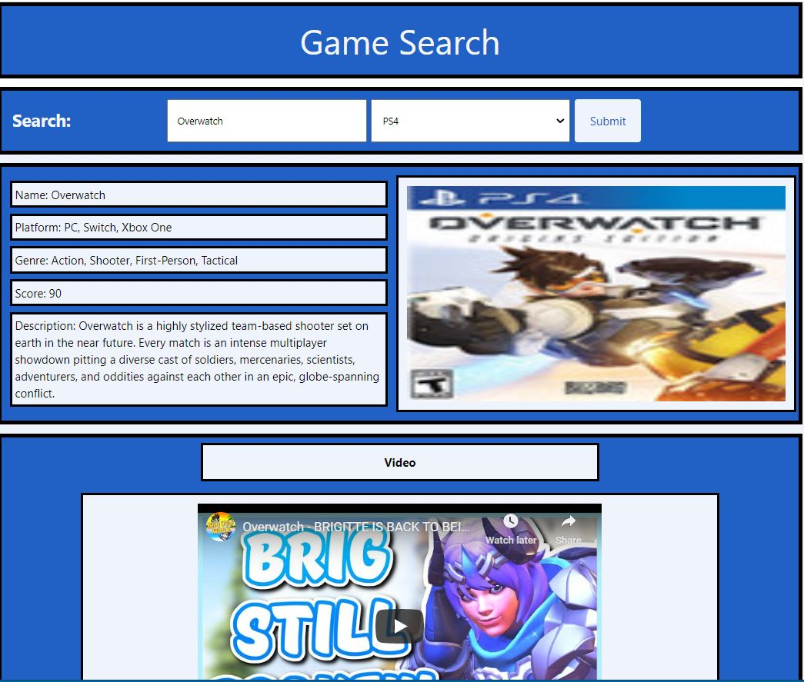

# **Game Search**

### **Table of Contents**
>  -  [About](#about)
>  -  [Technology](#technology)
>  -  [Description](#description)
>  -  [Contributors](#contributors)
>  -  [Credits](#credits)
>  -  [Release Notes](#release-notes)
>  -  [Screenshots](#screenshots)

 ## **About**
>  An Application that Enables the User to Search for Video Game Recommendations Based Off of Several User's Selections.

 ## ***[Team Avatar!](https://bg00924.github.io/Team-Avatar-project-1/)***

 ## **Description**
>  The User will be Able to Search for Games by Platform. This will Return with Video Game Information Such as Name, Platform, Genre, >  Score and a Brief Description. 
> 

 ## **Technology**
>  This Page was Built with the Following Technologies:


```bash
 HTML
 CSS
 JavaScript
 ```
<a href="https://bulma.io"></a>

 ## **Credits**
>  * Bulma
>  * Chicken Coop API
>  * YouTube
>  * Google

   *[Back to Top](#game-search)*

 ## **Release Notes**
>  * Version 1 is an MVP with basic functionality.

   *[Back to Top](#game-search)*

 ## **Screenshots**




   *[Back to Top](#game-search)*
   
## **Contributors**
>  * [Blake Gale](https://github.com/BG00924)
>  * [Chelsey Masood](https://github.com/devgirl221)
>  * Andre Mayberry
>  * [Rawnie Coquat](https://github.com/RawnieCole)

   *[Back to Top](#game-search)*
